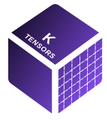

K-Tensors: Clustering Positive Semi-Definite Matrices
========================================================================================================================

    

## About the Function

` ClusteringCPC(Psis, K, max_iter=1000).clustering()`

input:
- Psis: a 3D array of size (n, p, p) where n is the number of matrices and p is the dimension of the positive semi-definite matrices.
- K: number of clusters
- max_iter: maximum number of iterations, default is 1000, usually finish within 10 iterations

return:
- group: a vector of length n, each element is an index of group membership
- CPCs: K orthonormal basis matrices of size p by p for each cluster
- $\mathbf F$: $\mathbf F = \mathbf B^\top \mathbf\Psi \mathbf B$
- $\text{diag}\mathbf F$: $\mathbf F = (\mathbf B^\top \mathbf\Psi \mathbf B) \circ \mathbf I$ the diagonal of matrix $\mathbf F$
- centers: Mean of each cluster
- loss: loss function for each iteration

